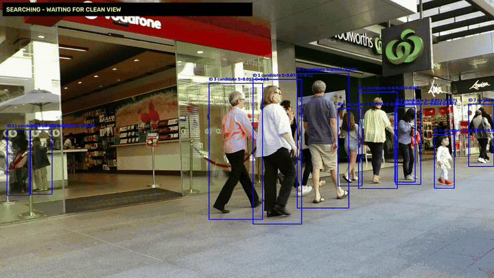
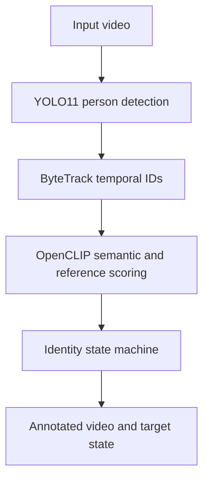

# Vision-Language Person Identification and Tracking

## SAM3 version / SAM3 新版本

The current SAM3-based offline prototype is available in **[sam3/](sam3/README.md)**.
It uses SAM3 text-prompted video segmentation, OpenCLIP appearance memory,
short-gap identity recovery, and conservative mask cleanup. A separate
Qwen3-VL action-understanding diagnostic is included; it does not control
tracking decisions. Robot motion control and real-time following are not yet
implemented.

**另一台电脑运行：** 克隆本仓库后进入 `sam3` 文件夹，按照
[中文安装与运行说明](sam3/README.md)重新建立环境、登录 Hugging Face
并下载模型。源视频、权重、虚拟环境及下载缓存不在仓库中。

```powershell
git clone https://github.com/FokerGgg/vlm-person-identification-tracking.git
cd vlm-person-identification-tracking\sam3
powershell -ExecutionPolicy Bypass -File .\setup_windows.ps1
```

The remaining sections document the original YOLO/OpenCLIP prototype under
`src/`; its code and demonstration assets are retained.

> Work in progress: a video perception prototype for finding and following a
> specified person from a natural-language description and, optionally, a
> reference image.



The original prototype detects people with YOLO11, assigns temporal track IDs
with ByteTrack, ranks candidates using OpenCLIP, and maintains a conservative
appearance memory for identity recovery. It is intended to become the
perception layer of a robot-following system; robot motion control and hardware
integration are not implemented in this repository yet.

## Current status

| Capability | Status | Evidence / boundary |
| --- | --- | --- |
| Person detection | Implemented | YOLO11 person-class detections |
| Natural-language target search | Implemented | OpenCLIP positive-vs-negative prompt scoring |
| Optional reference-image matching | Implemented | CLIP image-embedding similarity |
| Temporal track IDs | Implemented | Ultralytics ByteTrack integration |
| Multi-frame target confirmation | Implemented | Configurable acquisition gate |
| Occlusion-aware memory freeze | Prototype implemented | Appearance memory is not updated on overlapping crops |
| Post-occlusion re-identification | Prototype implemented | Heuristic multi-frame candidate verification; quantitative accuracy is not yet established |
| SAM 2.1 mask propagation | Separate experiment | Manual first-frame ROI; not integrated with the main pipeline |
| Robot control and safety interface | Planned | No motion commands or hardware deployment yet |
| Benchmark metrics | Planned | No HOTA, IDF1, MOTA, or ground-truth ID-switch results are claimed |

The demo above shows target acquisition, tracking, and entry into the
occlusion-protection state on a short MOT17-09 excerpt. It does **not** by itself
demonstrate successful post-occlusion re-identification; that requires a longer
sequence and ground-truth evaluation.

## Pipeline



The identity state machine uses conservative transitions:

`SEARCHING -> CONFIRMING -> TRACKING -> OCCLUDED -> RECOVERING`

During overlapping-person events, target-memory updates are frozen to reduce
feature contamination. Candidate switches require clean separation,
appearance agreement, a score margin, and confirmation over multiple frames.

## Repository structure

```text
.
├── assets/
│   ├── demo.gif
│   └── demo.mp4
├── experiments/
│   └── sam21_person_tracking.py
├── src/
│   ├── semantic_person_search.py
│   └── semantic_person_track.py
├── .gitignore
├── README.md
├── THIRD_PARTY_NOTICES.md
└── requirements.txt
```

## Installation

Python 3.10 or newer is recommended.

```bash
python -m venv .venv
```

Activate the environment, install the correct PyTorch build for your CPU/CUDA
configuration, and then install the remaining dependencies:

```bash
python -m pip install -r requirements.txt
```

Model weights and datasets are intentionally excluded from Git. Ultralytics
downloads `yolo11n.pt` automatically when it is not already present.

## Usage

### 1. Find a target and optionally save a clean reference crop

```bash
python src/semantic_person_search.py \
  --video path/to/input.mp4 \
  --query "a person wearing a grey shirt and carrying a shopping bag" \
  --save-reference outputs/target_reference.png \
  --output outputs/search.mp4
```

### 2. Track with text and the saved reference image

```bash
python src/semantic_person_track.py \
  --video path/to/input.mp4 \
  --query "a person wearing a grey shirt and carrying a shopping bag" \
  --reference-image outputs/target_reference.png \
  --output outputs/tracking.mp4
```

Use `python src/semantic_person_track.py --help` for the acquisition,
occlusion, feature-update, and re-identification thresholds.

### 3. Run the optional SAM 2.1 experiment

The SAM experiment requires a separate installation of Meta's SAM 2 repository
and a downloaded SAM 2.1 checkpoint. Meta's current installation instructions
require Python 3.10+, PyTorch 2.5.1+, and TorchVision 0.20.1+. The experiment
accepts an image-frame directory, opens a manual target-selection window on the
first frame, and propagates the mask through the sequence.

```bash
python experiments/sam21_person_tracking.py \
  --frames-dir path/to/numbered/frames \
  --sam2-dir path/to/sam2 \
  --output outputs/sam21_tracking.mp4
```

## What the on-screen values mean

- `S`: semantic score derived from the positive text similarity minus the mean
  similarity to generic negative prompts.
- `A`: cosine similarity to the frozen/adapted target appearance memory.
- `R`: cosine similarity to the optional fixed reference image.
- `O`: fraction of the candidate box overlapped by another detected person.
- `ID`: the current tracker ID. It is not a ground-truth identity label.

The terminal value `Confirmed tracker-ID changes` counts accepted internal
re-identification transitions. It must not be interpreted as a benchmark
ID-switch error metric.

## Known limitations

- Thresholds are manually tuned and have not been calibrated across datasets.
- Clothing-based CLIP features can confuse visually similar people.
- ByteTrack IDs can change during long occlusion or missed detections.
- The current `GLOBAL RE-IDENTIFICATION` state reports prolonged loss but does
  not yet perform a separate global-search policy.
- No real-time latency, accuracy, HOTA, IDF1, or MOTA results are available yet.
- The current output is an annotated video; no robot-safe target-control API is
  exposed yet.

## Roadmap

- Add ground-truth evaluation on MOT17-style and controlled crossing sequences.
- Report identity precision/recall, recovery success, IDF1/HOTA, and latency.
- Add deterministic tests for geometry, state transitions, and memory updates.
- Separate the state machine from video I/O for easier unit testing.
- Compare ByteTrack with BoT-SORT and a dedicated ReID embedding model.
- Define a confidence-gated robot output that slows or stops on uncertainty.
- Validate on the target robot camera before claiming real-time deployment.

## Data, dependencies, and attribution

The included demo is derived from the MOT17-09 sequence and is provided only to
illustrate the current prototype. MOTChallenge data is distributed under its
own terms (CC BY-NC-SA 3.0); the demo asset is not training data and is not
covered by any source-code license selected for this repository.

Core third-party components:

- [Ultralytics YOLO](https://docs.ultralytics.com/) for person detection and
  ByteTrack integration.
- [OpenCLIP](https://github.com/mlfoundations/open_clip) for text/image
  embeddings.
- [Meta SAM 2](https://github.com/facebookresearch/sam2) for the separate mask
  propagation experiment.
- [MOTChallenge](https://www.codabench.org/competitions/10049/) for the demo
  sequence.

No third-party repositories, model weights, checkpoints, or datasets are
vendored here. Review every dependency and dataset license before production or
commercial deployment.

This draft does not yet grant a separate license for the original source code.
See [THIRD_PARTY_NOTICES.md](THIRD_PARTY_NOTICES.md) before making the repository
public. In particular, Ultralytics offers its open-source software under
AGPL-3.0 and a separate Enterprise license.

